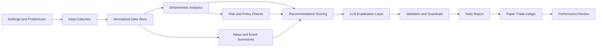

# AI Portfolio Research Agent

## 1. Project Summary

This project is a daily AI-assisted portfolio research system. It will analyze the user's holdings, watchlist, market data, company fundamentals, news, and portfolio risk, then produce a clear daily report with suggested actions.

The initial system is a **decision-support and paper-trading tool**, not an autonomous trading system. It will never place orders without explicit human approval. Its job is to make the user's daily review faster, more consistent, and better documented.

Example holdings may include:

- Broad index funds such as VTI
- Individual companies such as PLTR and KO
- Additional stocks and ETFs added to a personal watchlist

The system should recommend portfolio actions such as `buy/add`, `hold`, `reduce`, `avoid`, or `no action`. It should focus on allocation, risk, valuation, and evidence rather than pretending to predict the next day's price.

> This software is for personal research and education. It is not financial advice, and recommendations must be reviewed by the user before any investment decision.

---

## 2. Goals and Non-Goals

### Goals

1. Generate a reliable daily portfolio report before the chosen market review time.
2. Explain why an asset is being recommended, not only what action is suggested.
3. Combine deterministic financial calculations with AI-generated explanation.
4. Detect concentration, allocation, volatility, and diversification risks.
5. Track recommendations over time and measure whether the process is useful.
6. Make data freshness, missing data, uncertainty, and conflicts visible.
7. Start with paper recommendations and provide a path toward optional broker integration later.

### Non-goals for the first release

- Predicting exact daily prices.
- Guaranteeing returns or beating the market.
- Automatically placing trades.
- Replacing a licensed financial advisor.
- Making decisions from an LLM's general knowledge without verified current data.
- Scraping websites in ways that violate their terms of service.
- Building a high-frequency trading system.

---

## 3. Product Principles

### Evidence before language

The system must calculate and validate metrics in code before asking an AI model to summarize them. The model should not be trusted to invent prices, ratios, dates, or earnings results.

### Allocation before prediction

The core question is not "what will go up tomorrow?" It is:

> Given the user's goals, current holdings, risk limits, valuation, and available evidence, is there a rational reason to change the portfolio today?

### Recommendations must be explainable

Every recommendation should include:

- The action
- The relevant portfolio context
- The evidence used
- The main risks
- Confidence and uncertainty
- The condition that would cause the recommendation to change

### Human approval is mandatory

The first versions should create reports and paper trades only. Any future brokerage integration must have a separate approval step, visible order details, and an emergency disable switch.

### No action is a valid action

The agent should not manufacture a trade every day. If the evidence is weak, the portfolio is within limits, or costs and taxes outweigh the benefit, it should recommend no action.

---

## 4. Proposed User Experience

### Daily report

The report should be available through a command line command initially, followed by email or a small web dashboard.

Suggested report structure:

```text
Daily Portfolio Review - YYYY-MM-DD

Overall status: No action / Review needed / Action candidates
Portfolio value: $...
Cash: ...%
Data timestamp: ...

Top actions
1. VTI - Add / Hold / Reduce
   Suggested allocation change: ...
   Why: ...
   Risks: ...
   Confidence: ...

2. PLTR - ...

Portfolio health
- Individual-stock concentration: ...
- Largest sector exposure: ...
- Volatility: ...
- Drawdown: ...
- Allocation drift: ...

Market context
- Broad market trend: ...
- Volatility regime: ...
- Relevant macro events: ...

Events to watch
- Earnings
- Ex-dividend dates
- Economic releases
- Filing deadlines

Data quality
- Missing fields: ...
- Delayed sources: ...
- Conflicting values: ...

This report is research assistance, not financial advice.
```

### Recommendation vocabulary

Use a small controlled set of actions:

- `BUY_ADD`: Increase an existing position or initiate a small position.
- `HOLD`: Keep the current allocation.
- `REDUCE`: Decrease exposure because of risk, valuation, drift, or changed fundamentals.
- `WATCH`: Do not trade; monitor a defined event or condition.
- `AVOID`: Do not initiate a position under the current rules.
- `NO_ACTION`: The best decision is to leave the portfolio unchanged.

Recommendations should also have a time horizon such as `long_term`, `medium_term`, or `short_term`. The long-term portfolio should be the default focus.

---

## 5. System Architecture



### Recommended initial stack

- **Primary language:** Python 3.12+
- **Agent architecture:** One deterministic workflow orchestrator with typed specialist tools; add separate agents only when a tool boundary has a clear benefit
- **Agent framework:** Start with plain Python orchestration and Pydantic schemas; use LangGraph or PydanticAI only when stateful retries, branching, or human approval flows become difficult to maintain directly
- **Tool protocol:** Internal Python tool interfaces first; optionally expose tools through MCP later if they need to be shared with other agent clients
- **API:** A small command-line application first; FastAPI later if a web interface is needed
- **HTTP client:** `httpx` with timeouts, retries, rate-limit handling, and provider-specific adapters
- **Storage:** SQLite for the MVP
- **Data processing:** `pandas` for the initial analytics layer; add `polars` only if data volume or performance justifies it
- **Validation:** Pydantic models
- **Scheduling:** Windows Task Scheduler initially; APScheduler or a hosted scheduler later
- **Reports:** Markdown and HTML email initially
- **Testing:** `pytest`
- **Logging:** Python standard logging with structured JSON logs where practical
- **Configuration:** Environment variables for secrets; a versioned YAML or TOML file for non-secret preferences
- **Secrets:** Windows Credential Manager, an OS secret store, or a dedicated secret manager; never plaintext tokens in the repository

The exact market-data and LLM providers should remain behind interfaces so they can be replaced without rewriting the analysis engine.

### Why Python is the recommended primary stack

Python is the strongest default for this project because its financial-data, statistics, tabular-analysis, experimentation, and LLM ecosystems are especially mature. E\*TRADE's REST and OAuth endpoints do not require .NET; Python can call them through a normal typed HTTP adapter. The daily workload is small, so .NET's runtime performance is not a meaningful advantage.

Use .NET instead if one of these is already true:

- The project must run inside an existing .NET service or Azure Functions environment.
- You are substantially more productive and comfortable operating production services in C#.
- Your organization requires C#, Microsoft identity, or existing .NET observability and deployment standards.

Do not use both Python and .NET in the first version. A split stack would add deployment, authentication, monitoring, and schema-compatibility work without improving the research workflow.

### Recommended agent and tool design

The system should initially have one `daily_review` orchestrator that calls narrow, deterministic tools in a fixed order:

```text
daily_review
  -> get_portfolio_snapshot
  -> get_market_status
  -> get_quotes_and_history
  -> get_news_and_events
  -> calculate_portfolio_analytics
  -> apply_risk_rules
  -> create_recommendation_candidates
  -> explain_validated_candidates
  -> validate_report
  -> save_and_deliver_report
```

Each tool should have a typed input and output schema, explicit timeout behavior, and a source/timestamp in its result. Examples include:

- `get_portfolio_snapshot`: read-only E\*TRADE account and position data.
- `get_market_status`: exchange status, session, holiday, and timestamp.
- `get_market_data`: prices and historical candles from the selected market-data provider.
- `get_company_research`: fundamentals, filings, news, and earnings events.
- `calculate_portfolio_analytics`: weights, drift, concentration, volatility, and drawdown.
- `apply_risk_rules`: hard limits and data-quality gates.
- `create_recommendation_candidates`: transparent, deterministic candidate actions.
- `explain_validated_candidates`: LLM synthesis of already-validated facts.

The LLM should not decide which tools to call for safety-critical steps, calculate portfolio weights, bypass risk rules, or call E\*TRADE order endpoints. The orchestrator should control that workflow. A future research sub-agent may summarize filings or news, but its output must remain evidence with citations and must not directly create trades.

### Multi-agent decision

Do not begin with several autonomous agents. For this use case, most work is better represented as tools and deterministic services. Multiple agents add coordination failures, duplicated data fetching, higher LLM cost, and harder auditability.

Introduce a separate agent only when it has a clearly bounded responsibility, such as:

- A filing-research agent that returns cited excerpts.
- A news-synthesis agent that returns ranked, deduplicated events.
- A portfolio-review agent that explains deterministic analytics to the user.

All agents should communicate through versioned Pydantic schemas, and the final recommendation should be produced only after centralized policy and validation checks.

### Suggested directory layout

```text
trade-bot/
├── PROJECT_PLAN.md
├── README.md
├── pyproject.toml
├── .env.example
├── config/
│   ├── portfolio.example.yaml
│   └── rules.example.yaml
├── src/
│   └── trade_bot/
│       ├── cli.py
│       ├── settings.py
│       ├── models/
│       │   ├── portfolio.py
│       │   ├── market.py
│       │   ├── research.py
│       │   └── recommendations.py
│       ├── data/
│       │   ├── providers.py
│       │   ├── market_data.py
│       │   ├── fundamentals.py
│       │   ├── news.py
│       │   └── filings.py
│       ├── analytics/
│       │   ├── portfolio.py
│       │   ├── valuation.py
│       │   ├── technicals.py
│       │   ├── risk.py
│       │   └── scoring.py
│       ├── agent/
│       │   ├── prompts.py
│       │   ├── synthesis.py
│       │   └── validation.py
│       ├── reports/
│       │   ├── markdown.py
│       │   └── delivery.py
│       └── storage/
│           ├── database.py
│           └── repositories.py
├── tests/
│   ├── unit/
│   ├── integration/
│   └── fixtures/
├── data/
│   └── .gitkeep
└── reports/
    └── .gitkeep
```

---

## 6. Portfolio Data Model

The user should maintain a portfolio file that is easy to edit and can later be replaced by a broker import.

Example:

```yaml
account_currency: USD
cash: 2500
risk_profile: balanced
investment_horizon: long_term
max_single_stock_weight: 0.10
max_sector_weight: 0.30
minimum_cash_weight: 0.05
holdings:
  - symbol: VTI
    quantity: 25
    average_cost: 220.00
    asset_type: etf
    target_weight: 0.60
  - symbol: PLTR
    quantity: 15
    average_cost: 22.00
    asset_type: stock
    target_weight: 0.05
  - symbol: KO
    quantity: 20
    average_cost: 58.00
    asset_type: stock
    target_weight: 0.05
watchlist:
  - MSFT
  - BRK.B
  - VXUS
  - BND
```

### Required portfolio fields

- Symbol
- Quantity
- Average cost, if available
- Account or portfolio identifier
- Asset type
- Optional target allocation
- Optional tax lot information
- Optional investment thesis

### Privacy rules

- Never commit real holdings, account numbers, or API keys to source control.
- Store personal configuration outside tracked example files.
- Redact sensitive values in logs and error reports.
- Use `.env.example` to document required secrets without including actual values.

---

## 7. Data Sources

The application should use provider adapters with a common interface. A provider may supply some or all of the following:

### Market data

- Current and historical prices
- Adjusted close prices
- Trading volume
- Corporate actions
- ETF holdings, when available

### Fundamentals

- Revenue and earnings history
- Profit margins
- Free cash flow
- Debt and cash
- Shares outstanding
- Valuation ratios
- Guidance and estimates, where licensed and available

### Company events

- Earnings dates
- SEC filings
- Dividends
- Splits
- Management changes
- Material announcements

### News and macro data

- Relevant company news
- Sector developments
- Interest rates
- Inflation and employment releases
- Broad market volatility
- Economic calendar events

### Provider design requirements

Each provider should return:

- The data value
- Source name
- Source URL or identifier
- Retrieval timestamp
- Market timestamp, if different
- Currency and units
- Data quality status

The system should cache responses, respect rate limits, retry transient failures, and record provider failures clearly. It should not silently substitute stale values for current data.

### Concrete provider options

The project can fetch most required information from online REST APIs. No single provider is ideal for every category, so the application should use small provider adapters and combine a few sources.

| Data needed                              | Good starting sources                                                                                                                                       | Notes                                                                                                                       |
| ---------------------------------------- | ----------------------------------------------------------------------------------------------------------------------------------------------------------- | --------------------------------------------------------------------------------------------------------------------------- |
| Daily prices and OHLCV                   | [Finnhub](https://finnhub.io/docs/api), [Alpha Vantage](https://www.alphavantage.co/documentation/), or [Massive](https://massive.com/docs)                 | Confirm whether the selected plan includes historical candles, adjusted prices, and the required market coverage.           |
| Company news                             | [Finnhub company news](https://finnhub.io/docs/api/company-news) or [Alpha Vantage news and sentiment](https://www.alphavantage.co/documentation/)          | Store the original article URL, publisher, publication timestamp, and ticker relevance.                                     |
| Earnings calendar and surprises          | [Finnhub](https://finnhub.io/docs/api/earnings-calendar), [Alpha Vantage](https://www.alphavantage.co/documentation/), or a commercial market-data provider | Earnings timing is particularly important for individual stocks such as PLTR and KO.                                        |
| SEC filings and reported financial facts | [SEC EDGAR APIs](https://www.sec.gov/edgar/sec-api-documentation)                                                                                           | Official, key-free public APIs. Respect the SEC's access policy and identify the application with a descriptive User-Agent. |
| Macroeconomic data                       | [FRED API](https://fred.stlouisfed.org/docs/api/fred/)                                                                                                      | Useful for rates, inflation, employment, credit, and other market context. FRED API access requires an API key.             |
| ETF profile and holdings                 | Official issuer data, such as [Vanguard fund resources](https://investor.vanguard.com/investment-products/etfs/profile/vti), plus a market-data provider    | For VTI, issuer data is the preferred source for expense ratio, benchmark, and holdings. Holdings can be delayed.           |
| Portfolio positions                      | User-maintained YAML/CSV first; later a broker's read-only API or an aggregator such as Plaid Investments                                                   | Do not request brokerage credentials until the paper-trading version works.                                                 |
| Currency conversion                      | A market-data provider or a dedicated foreign-exchange API                                                                                                  | The MVP can remain USD-only.                                                                                                |

### Recommended MVP combination

For a daily, U.S.-focused portfolio report, start with:

1. **Finnhub or Alpha Vantage** for quotes, daily history, company news, earnings events, and basic company metrics.
2. **SEC EDGAR** as the primary source for U.S. filings and as an independent check on reported financial data.
3. **FRED** for macroeconomic series and release context.
4. **Vanguard's official data** for VTI's fund facts and holdings where available.
5. A local YAML file for holdings until read-only broker synchronization is needed.

This is enough to analyze allocation, price history, valuation context, filings, news, earnings dates, and macro conditions without requiring real-time tick data.

### What not to use as the primary source

Libraries such as `yfinance` can be convenient for prototypes, but they are wrappers around web-accessible data rather than a guaranteed commercial data contract. They may be useful for early experiments, but the production path should use a provider with documented API behavior, limits, attribution rules, and data licensing.

Similarly, a generic web search or an LLM's built-in knowledge is not a market-data source. The agent must fetch current facts from an identifiable provider and attach timestamps to them.

### Data-fetching pattern

Each adapter should normalize provider-specific responses into the same internal shape:

```json
{
  "symbol": "VTI",
  "field": "close",
  "value": 250.12,
  "currency": "USD",
  "market_timestamp": "2026-09-04T20:00:00Z",
  "retrieved_at": "2026-09-06T12:00:00Z",
  "source": "provider_name",
  "source_url": "https://example.com/source",
  "quality_status": "verified"
}
```

The analysis engine should consume this normalized record, not provider-specific JSON. This makes it possible to change providers later and makes stale, missing, delayed, or conflicting data visible to the report.

---

## 8. Analytics Engine

The analytics engine is the most important part of the system. It should be deterministic, tested, and independent of the LLM.

### Portfolio analytics

Calculate:

- Current market value by holding
- Total portfolio value
- Weight by asset
- Weight by sector and geography
- Cash percentage
- Equity versus bond or fixed-income exposure
- Allocation drift from targets
- Largest positions
- Concentration metrics
- Realized and unrealized gain/loss, if cost data is available
- Dividend income estimates, with clear uncertainty labels

### Risk analytics

Calculate where data supports it:

- Historical volatility
- Maximum drawdown
- Beta relative to a benchmark
- Correlation between holdings
- Downside capture
- Value at risk only as an informational statistic, not a guarantee
- Exposure to overlapping holdings, especially inside ETFs
- Single-stock and sector concentration

### Fundamental analysis

For individual stocks, evaluate:

- Revenue and earnings growth
- Margin trend
- Free cash flow trend
- Debt burden and liquidity
- Valuation relative to its own history and relevant peers
- Share dilution
- Earnings quality
- Guidance changes
- Business-specific risks

For index funds, evaluate:

- Expense ratio
- Diversification
- Index methodology
- Sector and geographic exposure
- Tracking difference
- Overlap with other funds

### Technical and market context

Use technical metrics as context, not as the sole reason for a recommendation:

- Trend over multiple horizons
- Relative strength
- Moving-average relationship
- Volume changes
- Volatility regime
- Gap or event behavior

The default investment horizon should be long term. Short-term indicators should never override a hard portfolio risk limit without an explicit rule explaining why.

---

## 9. Recommendation Engine

The recommendation engine should produce structured candidate recommendations before the LLM writes prose.

### Example recommendation object

```json
{
  "symbol": "VTI",
  "action": "BUY_ADD",
  "horizon": "long_term",
  "suggested_weight_change": 0.01,
  "confidence": 0.72,
  "reasons": [
    "Current weight is below target",
    "Broad diversification improves portfolio balance",
    "No hard risk limit is exceeded"
  ],
  "risks": [
    "Broad equity market drawdown",
    "Purchase may be poorly timed around a major event"
  ],
  "invalidation_conditions": [
    "Portfolio reaches target weight",
    "User's risk profile or cash needs change"
  ],
  "evidence_ids": ["price-2026-09-06", "allocation-2026-09-06"]
}
```

### Scoring approach

Start with transparent rules rather than a black-box model. A candidate score can combine:

- Allocation need
- Risk adjustment
- Fundamental quality
- Valuation
- Momentum and market context
- Event risk
- Data quality
- Transaction cost and tax considerations

The score should never override hard constraints. For example, if a position exceeds the user's maximum size, a high momentum score should not produce a buy recommendation.

A simple implementation can use a weighted score from `-100` to `100`, but the report must also show the component scores. The weights should be configurable and versioned.

### Recommendation thresholds

Example starting rules:

- Strong positive score and allocation room: `BUY_ADD`
- Neutral score: `HOLD` or `NO_ACTION`
- Negative score with excessive weight or deteriorating evidence: `REDUCE`
- Insufficient evidence: `WATCH`
- Hard policy violation: `AVOID` or `REDUCE`

These are starting points, not universal financial rules. They should be calibrated using paper results and reviewed by the user.

---

## 10. LLM Integration

The AI model should be an explanation and synthesis layer, not the source of truth.

### Inputs to the model

Provide structured JSON containing:

- Portfolio snapshot
- Deterministic analytics
- Candidate recommendations
- News summaries with source metadata
- Upcoming events
- Data quality warnings
- User's rules and risk profile
- Previous recommendation outcomes, if relevant

### Required model output

The model should return structured output matching a schema. It should not be allowed to return arbitrary prose as the only result.

Required fields:

- Executive summary
- Recommendation list
- Evidence references
- Risks
- Missing-data warnings
- Confidence explanation
- Suggested follow-up questions

### Prompt rules

The system prompt should tell the model to:

- Use only supplied evidence.
- Never invent current prices, dates, metrics, or sources.
- Distinguish facts from interpretation.
- Mention conflicting data.
- Avoid promises of profit.
- Prefer no action when evidence is weak.
- Respect hard portfolio constraints.
- Use cautious language for uncertainty.
- Include source identifiers for claims.

### Output validation

After model generation:

1. Validate the response against a Pydantic schema.
2. Confirm every referenced evidence ID exists.
3. Confirm numerical values match the deterministic input where applicable.
4. Reject or downgrade output that contains unsupported claims.
5. Regenerate once with a correction prompt, then fail safely if it remains invalid.

---

## 11. Safety, Compliance, and Operational Controls

This project concerns financial decisions, so safety controls are part of the core architecture.

### Required controls

- Paper trading by default
- Explicit user confirmation before any future order submission
- Daily spending and position limits
- Maximum single-position and sector weights
- Kill switch to disable recommendations or trading integration
- Full audit log of inputs, outputs, model version, and rule version
- Clear timestamps and timezone handling
- Stale-data detection
- Provider outage handling
- No recommendation when critical data is missing
- Separate read-only market-data credentials from any future trading credentials
- No broker credentials in source code or logs

### Brokerage integration policy

Broker integration should be a later phase. If implemented:

1. Start with read-only account synchronization.
2. Add paper-account order previews.
3. Require explicit approval for each order or batch.
4. Display symbol, side, quantity, estimated price, estimated value, and reason.
5. Require a second confirmation for unusual or high-value orders.
6. Add daily loss, notional, and order-count limits.
7. Add a kill switch that is independent of the LLM.
8. Never let the LLM call a raw broker API directly.

### E\*TRADE API intended use

The planned E\*TRADE integration is for the user's own account only. The initial purpose is to retrieve account balances, positions, quantities, and related portfolio information each day so the research agent has an accurate portfolio snapshot.

For the MVP:

- The user is the beneficial owner of every account accessed.
- No person other than the beneficial owner will be allowed to trade through the application.
- The application will not submit orders or enable trading.
- E\*TRADE data will be used only by the user in the private application and will not be redistributed or passed through to other end-users.
- The application is not an add-on or end-user product offered to other people.
- The application will not provide a UI through which other end-users can enter orders.
- Any future order functionality would require a new review of E\*TRADE's permissions, agreements, and safeguards.

The E*TRADE connection should be implemented as a broker-data adapter behind the same internal interface as the local YAML portfolio file. The adapter should normalize positions into the internal holdings model, record retrieval timestamps, identify the account source, and flag differences between E*TRADE and local configuration.

The first E\*TRADE milestone should be:

1. Authenticate using E\*TRADE's approved OAuth flow and store tokens securely.
2. Retrieve account list and account balances.
3. Retrieve positions for the selected account.
4. Reconcile symbols, quantities, and market values against the local snapshot.
5. Generate a read-only portfolio report.
6. Keep order endpoints disabled in code and configuration.

Market Data questionnaire answers must reflect the actual permissions and agreements in the E*TRADE subscription center. If the application uses a separate market-data provider for prices and analysis, answer the market-data questions according to whether E*TRADE itself will be queried for market data, not merely whether the application uses market data from another source.

The answer to any question about completing E\*TRADE market-data agreements must be `Yes` only after the required agreements have actually been accepted. Until then, use `No` or the application's truthful equivalent and complete the agreements before requesting that capability.

---

## 12. Storage and Audit Trail

Use SQLite for the first version.

### Core tables

#### `holdings`

- `id`
- `account_id`
- `symbol`
- `quantity`
- `average_cost`
- `target_weight`
- `updated_at`

#### `market_snapshots`

- `symbol`
- `price`
- `currency`
- `market_timestamp`
- `retrieved_at`
- `source`
- `quality_status`

#### `fundamental_snapshots`

- `symbol`
- `metric_name`
- `metric_value`
- `period_end`
- `source`
- `retrieved_at`

#### `news_items`

- `id`
- `symbol`
- `headline`
- `summary`
- `source`
- `published_at`
- `retrieved_at`
- `relevance_score`

#### `recommendations`

- `id`
- `report_date`
- `symbol`
- `action`
- `suggested_weight_change`
- `confidence`
- `reason_json`
- `risk_json`
- `evidence_json`
- `engine_version`
- `model_version`

#### `paper_trades`

- `id`
- `recommendation_id`
- `symbol`
- `side`
- `quantity`
- `reference_price`
- `opened_at`
- `closed_at`
- `status`
- `result`

#### `runs`

- `id`
- `started_at`
- `completed_at`
- `status`
- `error_summary`
- `config_version`
- `data_summary`

This audit trail makes it possible to answer what the system knew, when it knew it, and why it generated a recommendation.

---

## 13. Scheduling and Failure Handling

### Daily run sequence

1. Load configuration and validate it.
2. Load holdings and watchlist.
3. Fetch market data.
4. Fetch fundamentals and events.
5. Fetch relevant news.
6. Normalize and timestamp data.
7. Run data-quality checks.
8. Calculate portfolio analytics.
9. Apply hard risk rules.
10. Generate candidate recommendations.
11. Ask the LLM for a structured explanation.
12. Validate the response.
13. Render and save the report.
14. Send the report through the chosen channel.
15. Record the complete run in the audit log.

### Failure behavior

- If a non-critical provider fails, generate a partial report with a visible warning.
- If price data is missing for a held asset, do not calculate a new action for it.
- If critical portfolio data is missing, produce a health/error report and no recommendations.
- Retry transient network failures with bounded exponential backoff.
- Avoid repeated retries that could exceed provider rate limits.
- Preserve the previous successful report and mark the new run as incomplete.

### Time handling

Use a configured timezone, such as `America/New_York`, and store timestamps in UTC. Reports should clearly state whether prices are pre-market, regular-session, or after-hours.

---

## 14. Testing Strategy

### Unit tests

Test:

- Portfolio weights
- Allocation drift
- Average cost and gain/loss calculations
- Concentration limits
- Sector aggregation
- Drawdown and volatility calculations
- Recommendation thresholds
- Stale-data detection
- Currency and unit normalization
- Schema validation

### Integration tests

Use recorded fixtures rather than live providers. Test:

- Provider response normalization
- End-to-end report generation
- Provider failure behavior
- Missing-data behavior
- LLM response validation
- Database persistence

### Safety tests

Verify that:

- No recommendation can bypass hard position limits.
- The system never creates an order from an unvalidated model response.
- Missing critical data produces no trade recommendation.
- Secrets are not included in logs.
- Paper mode remains the default.
- Kill-switch behavior works.

### Evaluation tests

Create a historical or replay dataset and evaluate:

- Recommendation consistency
- Data freshness
- Number of unsupported claims
- Portfolio turnover
- Drawdown compared with a simple benchmark
- Whether recommendations respected user rules
- Whether the daily report was understandable and actionable

Do not evaluate the system only by short-term returns. Process quality and risk control matter more during the initial period.

---

## 15. Implementation Roadmap

### Phase 0: Define the user's policy

Deliverables:

- Current holdings and watchlist
- Risk profile
- Investment horizon
- Target allocations
- Maximum position and sector limits
- Cash needs and excluded assets
- Preferred report time and delivery method

Exit criteria:

- The rules are written down and can be represented in configuration.

### Phase 1: Portfolio and report skeleton

Build:

- Python project structure
- Configuration loading
- Portfolio file parsing
- SQLite schema
- Markdown report generator
- CLI command such as `python -m trade_bot daily-report`

Exit criteria:

- A report can be generated from local fixture data without network access.

### Phase 2: Market-data integration

Build:

- Provider interface
- One market-data provider
- Historical price ingestion
- Caching and rate-limit handling
- Data timestamps and quality checks

Exit criteria:

- The report displays current and historical market data with source and timestamp.

### Phase 3: Deterministic analytics

Build:

- Allocation and drift calculations
- Portfolio risk metrics
- Basic valuation and fundamental metrics
- ETF overlap and sector exposure
- Transparent recommendation scoring

Exit criteria:

- The recommendation engine works without an LLM and passes unit tests.

### Phase 4: News and events

Build:

- News provider adapter
- SEC or filings adapter where applicable
- Earnings and dividend calendar
- Relevance filtering
- Source links and summaries

Exit criteria:

- The report identifies relevant events and shows where they came from.

### Phase 5: LLM explanation layer

Build:

- Structured prompt
- Pydantic output schema
- Evidence references
- Validation and retry behavior
- Cost and token logging without storing unnecessary sensitive data

Exit criteria:

- The LLM only explains validated candidates and cannot override hard rules.

### Phase 6: Delivery and scheduling

Build:

- Windows Task Scheduler instructions
- Email, Discord, or Telegram delivery
- Saved report history
- Run status notifications

Exit criteria:

- A complete report is generated and delivered reliably on schedule.

### Phase 7: Paper-trading evaluation

Build:

- Recommendation ledger
- Paper positions
- Benchmark comparison
- Monthly evaluation report
- Rule and weight tuning process

Exit criteria:

- At least several weeks of paper results are available for review.

### Phase 8: Optional read-only broker sync

Build:

- Read-only account connection
- Position reconciliation
- Import mismatch warnings
- E\*TRADE account and position adapter
- Secure OAuth token storage
- Explicitly disabled order endpoints

Exit criteria:

- Broker data can be compared with local configuration without any order capability.

### Phase 9: Optional order preview and approval

Only after the previous phases are stable:

- Generate proposed order tickets
- Require explicit user approval
- Add strict notional and frequency limits
- Keep execution disabled by default

---

## 16. Configuration Decisions to Make

Before implementation, decide:

### Portfolio policy

- What percentage should be in broad index funds?
- What is the maximum allocation to one company?
- What is the maximum allocation to one sector?
- Are international funds, bonds, or cash required?
- Are there assets that should never be suggested?
- Is tax impact part of the recommendation policy?

### Analysis policy

- Long-term investing only, or include short-term ideas?
- How much should valuation matter relative to allocation drift?
- Should dividends be reinvested in the model?
- How should earnings dates affect recommendations?
- What confidence level is required to show a buy candidate?

### Product policy

- Report time and timezone
- Delivery channel
- Retention period for reports and data
- LLM provider and budget
- Data provider budget and rate limits
- Whether the project remains local-only

### Security policy

- Where secrets are stored
- Whether the machine is encrypted
- Whether reports contain sensitive portfolio details
- Whether external services may receive holdings data

---

## 17. Initial Acceptance Criteria

The MVP is complete when:

- A user can configure holdings without editing Python code.
- The system generates a daily Markdown report.
- At least one market-data provider is integrated.
- Portfolio weights and allocation drift are correct for known fixtures.
- Hard limits block unsafe recommendations.
- Missing and stale data are clearly reported.
- Every recommendation includes evidence, risks, confidence, and invalidation conditions.
- The LLM cannot invent metrics without validation catching the issue.
- Reports and recommendation inputs are stored for later review.
- The system runs in paper mode only.
- Automated tests cover the calculation and safety-critical paths.

---

## 18. Recommended First Build

The first implementation should be intentionally small:

1. Create the Python project and configuration files.
2. Add a local portfolio YAML file using example holdings only.
3. Implement portfolio weights, targets, drift, and concentration checks.
4. Generate a Markdown report from fixture market data.
5. Add one live market-data provider behind an adapter.
6. Add deterministic `BUY_ADD`, `HOLD`, `REDUCE`, `WATCH`, and `NO_ACTION` candidates.
7. Add paper-trade recording.
8. Only then add news and the LLM explanation layer.

This ordering makes it possible to verify the financial logic before introducing model behavior, provider costs, or automation complexity.

---

## 19. Open Questions

The project is ready to begin once these questions are answered:

1. Which brokerage account, if any, should eventually be supported?
2. What are the current holdings, quantities, target allocations, and cash balance?
3. What is the user's risk profile and investment horizon?
4. What is the preferred daily report time and timezone?
5. Should the first delivery method be a saved Markdown file, email, Discord, or Telegram?
6. Which data-provider budget is acceptable?
7. Should the analysis be local-only, or may portfolio data be sent to an external AI provider?
8. What is the maximum acceptable monthly operating cost?
9. Should the agent include tax-aware suggestions, or ignore taxes initially?
10. How long should paper recommendations be evaluated before changing the rules?

---

## 20. Final Design Decision

The recommended product direction is:

> A local-first daily portfolio research assistant that combines deterministic portfolio analytics, verified market and company data, transparent risk rules, and an LLM explanation layer. It produces paper recommendations and maintains an audit trail. Brokerage integration, if ever added, remains opt-in, approval-based, and separated from the AI reasoning layer.

That design keeps the project useful from the first milestone while preventing the most dangerous failure mode: an AI system confidently turning incomplete or incorrect information into an automatic trade.
